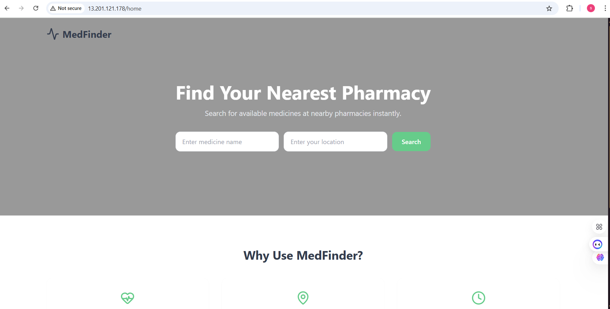
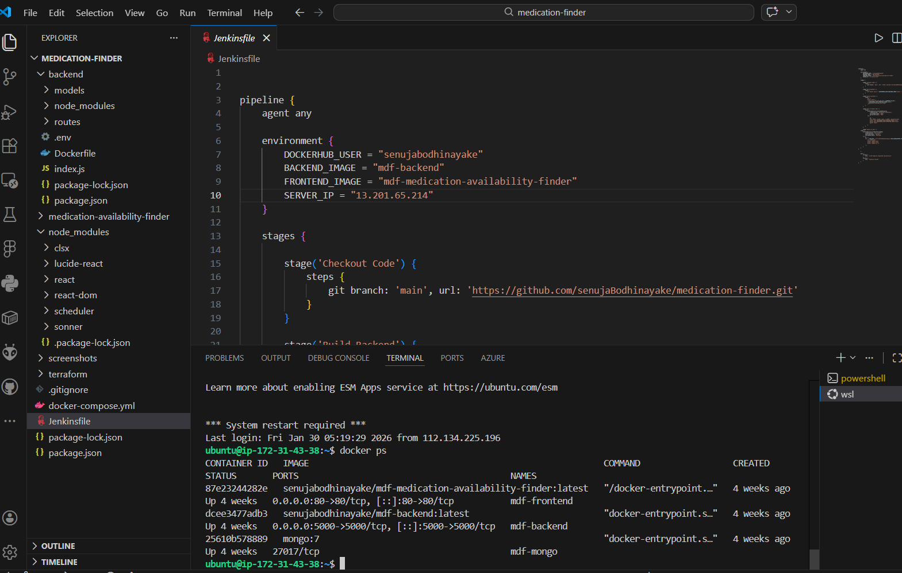
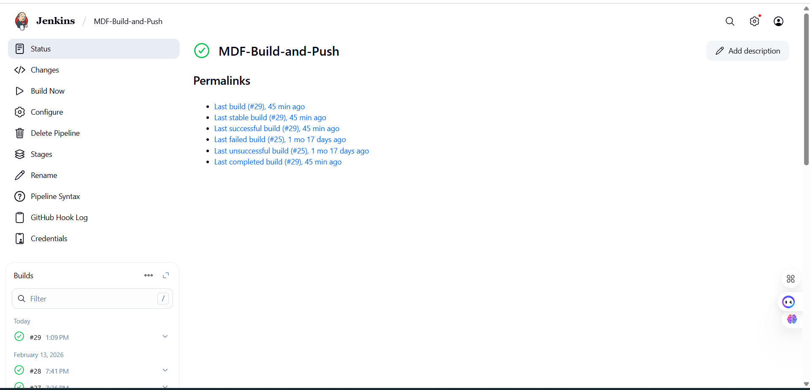
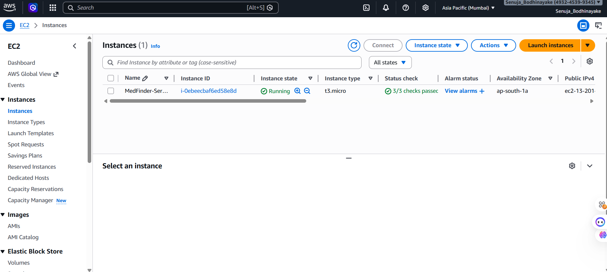

# 💊 Medication Availability Finder

A full-stack MERN application designed to help users find available medications, deployed using a complete **DevOps CI/CD pipeline** with containerization and cloud infrastructure.

---

## 🚀 Overview

This project demonstrates an **end-to-end DevOps workflow**, integrating modern tools and practices to automate build, deployment, and infrastructure provisioning.

The system allows users to search for medicine availability while showcasing:

- CI/CD automation
- Containerized application architecture
- Infrastructure as Code (IaC)
- Cloud deployment on AWS

---

## 🏗️ System Architecture

GitHub  
↓  
Jenkins (CI/CD Pipeline)  
↓  
Docker Build  
↓  
Docker Hub (Image Registry)  
↓  
Terraform (Infrastructure as Code)  
↓  
AWS EC2 (Deployment)

---

## 🛠️ Tech Stack

### Application Layer
- React (Frontend)
- Node.js + Express (Backend)
- MongoDB (Database)

### DevOps & Cloud
- Docker
- Docker Compose
- Jenkins
- Terraform
- AWS EC2
- Docker Hub
- Git & GitHub

---

## ⚙️ Features

- Search medicine availability
- Full-stack MERN application
- Containerized services using Docker
- Automated CI/CD pipeline with Jenkins
- Infrastructure provisioning using Terraform
- Cloud deployment on AWS EC2

---

## 🐳 Docker Setup

Each service is containerized:

- Frontend → React container  
- Backend → Node.js container  
- Database → MongoDB container  

Run locally:

```bash
docker-compose up --build

## 📸 Screenshots

### Application UI


### Docker Containers


### Jenkins Pipeline


### EC2 Instance

